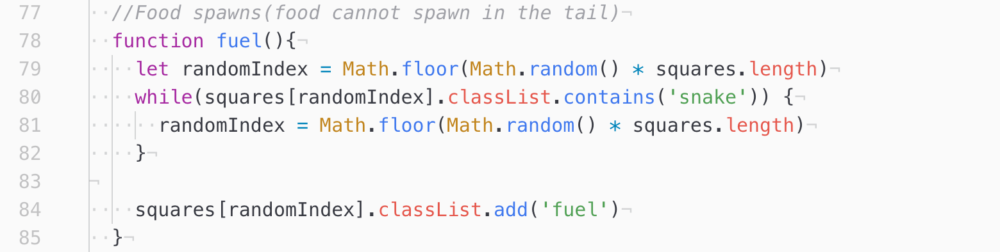
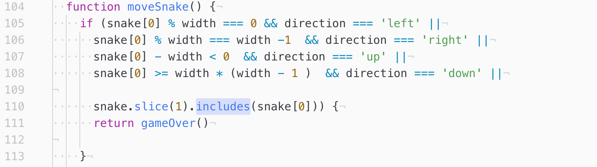

# SEI-Project-1

## Project One: JavaScript Snake Game (Ghosts & Ghouls)

### Timeframe
1 week

### Technologies used

* JavaScript (ES6)
* HTML5
* CSS
* git

* _Other technologies used: (HTML5 Audio, localStorage)_

### Installation

1. Clone or download the repo
1. Open the `index.html` in your browser of choice

### Introduction
_This is my take on traditional snake, the theme for this game is ghouls & ghosts_

### Controls
_Use the left, right, up and down arrow keys to control the direction of the Ghostbuster's movement_

### Game Instructions
_When you spawn into the game, the ghostbusters will immediately start marching, use the arrow keys to keep them away from the walls and guide them towards the vile ghouls! With each ghoul you destroy, the more ghostbusters will join to your ranks. The more ghostbusters you have, the faster you will go!_

### Process of Creating Snake
To create this game, I used various programs and coding languages (JavaScript, HTML5 & CSS) in ATOM. Along side external platforms like "ezgif.com" and "pixlr.com" for image editing. To get started I first created a "grid" class for divs in my HTML file in order to define them better in the CSS and JS files, I then gave the grid some styling so I could see them in the browser. I then gave the gird dimensions in the JS and began styling it and then repeated the same for the creation of the snake, with the addition of directional logic for the snake.

### Time management
In order to manage my time, I got started on a Trello and created a list of things to complete and tracked the things I could and could not finish.

### How I would do things next time
I would try and manage my time a little better and focus on adding more features before worrying about styling.

### Challenges
There were many challenges in the creation of this game, but one notable challenge I faced was getting the "ghoul" to stop spawning within the line of ghostbusters. I tried a number of different methods to stop this bug from occurring, but in the end I found a solution to my bug using thee "includes" method to stop it from spawning within the body of my snake.

### Wins
Th game is working and running without and hitches, all of the bugs I had are finally ironed out and I have a cohesive theme that really brings my game to life. I also managed to fix all the CSS issues I had with centring my content and images, overall making my game look much nicer and smoother to play.

### Future features
When I return to this project I will be adding nicer features like a starting page, things like:

* Image flipping for the ghostbusters as they turn direction

* Sounds upon capturing ghouls & body growth

* A highscore record

* A change in the soundtrack once you reach a certain length and a max speed cap.
